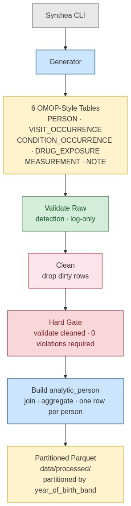
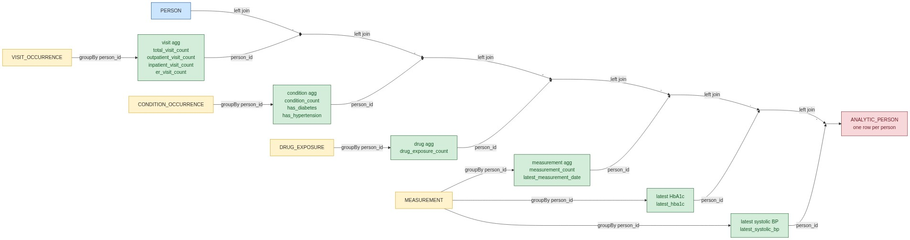

# Synthetic OMOP-Style Healthcare Batch Pipeline

A Python/PySpark batch pipeline project built on a fully synthetic OMOP-style healthcare dataset. The goal of Block 1 is to establish a clean, testable, and interview-ready foundation for a healthcare data pipeline using a simplified subset of OMOP-like tables. 

## Data flow



## Architecture


## Output dataset

The pipeline produces a patient-level analytics table (`analytic_person`) with one row per person, containing:

- age (as of 2025-01-01) and decade band (e.g., `1980s`)
- visit counts — total, outpatient, inpatient, and ER
- condition count with diabetes and hypertension flags
- drug exposure count
- measurement count
- latest HbA1c value
- latest systolic blood pressure
- latest measurement date

Written as partitioned Parquet under `data/processed/`, partitioned by `year_of_birth_band`.

### Joins and aggregations



Each clinical table is aggregated by `person_id`, then left-joined onto PERSON to produce one row per person.

## Scope

Block 1 includes:
- project documentation (`spec.md`, `plan.md`, `tasks.md`)
- synthetic OMOP-style data design and generation via Synthea
- a PySpark batch pipeline with validation, cleaning, and transformation
- 103 tests with `pytest`
- a demo notebook

Block 1 does not include:
- large-scale performance tuning
- orchestration or scheduling
- cloud deployment
- full OMOP vocabulary mapping
- advanced healthcare semantics

## Tech stack

- Python 3.11+
- PySpark
- pandas (data generation)
- pytest
- Jupyter Notebook / JupyterLab
- Java 11+ (Synthea only)

## Project structure

```text
docs/           project specification, plan, and tasks
src/            pipeline modules and helper code
tests/          pytest-based tests (103 tests)
notebooks/      demo notebook (demo.ipynb)
scripts/        utility scripts (run_synthea.ps1)
data/synthea_raw/  raw Synthea CSV export (git-ignored)
data/raw/       simplified OMOP-style tables (git-ignored)
data/processed/ analytic_person partitioned Parquet (git-ignored)
data/sample/    tiny test fixtures (committed)
```

## Setup

Prerequisites:
- Python 3.11+
- Java 21 LTS (required once, to run Synthea and produce the raw patient export)

1. Create and activate a virtual environment.
2. Install dependencies from `requirements.txt`.
3. Download `synthea-with-dependencies.jar` from the [Synthea releases page](https://github.com/synthetichealth/synthea/releases/latest) and place it at `tools/synthea-with-dependencies.jar` (git-ignored).
4. Run Synthea to generate the raw CSV export into `data/synthea_raw/`.
5. Run the generator to map Synthea output into the simplified OMOP-style tables in `data/raw/`.
6. Run the pipeline to validate, clean, transform, and write `data/processed/`.
7. Run tests.
8. Open the notebook demo.

```bash
# 1-2. Environment
python -m venv myenv
source myenv/bin/activate           # Windows: myenv\Scripts\activate
pip install -r requirements.txt

# 3-6. Run everything end-to-end (Synthea → generator → pipeline)
python scripts/run_all.py

# Or run each step individually:
# python -m src.generator            # map Synthea CSV → data/raw/
# python -m src.pipeline             # validate → clean → transform → data/processed/

# 7. Tests
pytest

# 8. Demo notebook
jupyter notebook notebooks/demo.ipynb
```

## Expected row counts

Data is generated with a fixed seed (`RANDOM_SEED=42`), so row counts are deterministic. After running the pipeline, your `data/processed/pipeline_metrics.json` should match these counts exactly.

| Table | Raw | Cleaned | Dropped |
|---|---:|---:|---:|
| person | 11,770 | 11,424 | 346 |
| visit_occurrence | 23,541 | 22,175 | 1,366 |
| condition_occurrence | 5,037 | 4,817 | 220 |
| drug_exposure | 4,564 | 4,223 | 341 |
| measurement | 24,431 | 22,639 | 1,792 |
| note | 46,729 | 22,847 | 23,882 |
| **analytic_person** | — | **11,424** | — |

Raw validation detects 21 check failures across the 6 tables. After cleaning, all checks pass with 0 violations. The full reference file is at [`data/sample/expected_metrics.json`](data/sample/expected_metrics.json).

### Drop reasons

Rows can fail multiple checks, so individual violation counts may exceed the total dropped.

| Table | Dropped | Reasons (violations detected) |
|---|---:|---|
| person | 346 | null `year_of_birth` (176), duplicate PK (173) |
| visit_occurrence | 1,366 | null `visit_concept_id` (352), bad end date (350), duplicate PK (347) |
| condition_occurrence | 220 | null `condition_concept_id` (75), bad end date (77), duplicate PK (74) |
| drug_exposure | 341 | null `drug_concept_id` (68), bad end date (78), negative `days_supply` (69), negative `quantity` (68), duplicate PK (67) |
| measurement | 1,792 | null `measurement_date` (366), negative `value_as_number` (367), orphan `person_id` (363), duplicate PK (361) |
| note | 23,882 | null `note_date` (23,188), null `note_text` (23,541), orphan `visit_occurrence_id` (6), duplicate PK (23,534) |

## Tests

103 tests across 3 test files, all run with `pytest` against in-memory Spark DataFrames.

| File | Tests | What it covers |
|---|---:|---|
| `test_validations.py` | 50 | One test per validation check per table — null checks, duplicate PK, bad dates, negative values, orphan FKs, plus edge cases (e.g., null end date is allowed). Also tests `validate_all` aggregation. |
| `test_transforms.py` | 45 | Cleaning functions for all 6 tables — verifies each drop rule (nulls, bad dates, negatives, orphans, duplicates) and edge cases (e.g., zero `days_supply` is kept, null optional FKs are kept). Also tests `clean_all` before/after metrics and `build_analytic_person` — age calculation, decade band, visit count aggregation, condition flags, latest measurement values, and null handling for persons with no data. |
| `test_pipeline.py` | 8 | Pipeline orchestration — `PipelineValidationError` type, hard gate pass/fail behavior, error message content, and validation logging (warnings on violations, silence on clean data, stage name in log output). |

### Test categories

| Category | Tests | Examples |
|---|---:|---|
| Null checks | 27 | Required fields reject nulls; optional fields (end dates, FKs) allow them |
| Duplicate PK | 13 | Each table's dedup logic, including the "no dup when unique" case |
| Date order | 9 | End date before start date is rejected; equal dates are kept |
| Negative values | 8 | Negative `days_supply`, `quantity`, `value_as_number` are dropped; zero is kept |
| Orphan FK | 7 | Orphan `person_id` and `visit_occurrence_id` are dropped; null FKs are kept |
| Aggregation | 10 | Visit counts by type, condition flags, latest HbA1c/BP, zero counts for persons with no data |
| Pipeline | 8 | Hard gate pass/fail, error message content, logging behavior |
| Integration | 3 | `validate_all` combines results, `clean_all` returns correct metrics |

All tests use in-memory Spark DataFrames with minimal fixture data — no files on disk are needed.

## Data note

This project uses synthetic OMOP-style healthcare data only. Bulk generated data is stored locally and is not committed to version control.

## Implementation phases

Block 1 was built across 13 phases (0–12), each delivered as a separate branch and PR.

| Phase | Deliverable |
|---:|---|
| 0 | Project documentation — `spec.md`, `plan.md`, `tasks.md` |
| 1 | Environment and config foundation — `src/config.py` |
| 2 | Synthea inspection — grounded design in real Synthea output |
| 3 | Concept dictionaries — `src/concepts.py` |
| 4 | PySpark schemas — `src/schemas.py` |
| 5 | Data generator — `src/generator.py` (Synthea CSV to raw OMOP tables with dirty-data injection) |
| 6 | I/O utilities — `src/io_utils.py` (Spark read/write helpers) |
| 7 | Validations — `src/validations.py` (null, range, FK, date-order, duplicate checks) |
| 8 | Transforms — `src/transforms.py` (cleaning and `analytic_person` build) |
| 9 | Pipeline orchestration — `src/pipeline.py` |
| 10 | Tests — 103 pytest tests |
| 11 | Demo notebook — `notebooks/demo.ipynb` |
| 12 | Polish — docs cleanup, `run_all.py`, final fixes |

## Status

Block 1 is complete. All phases have been merged, 103 tests pass, and the demo notebook runs end-to-end. Later blocks may expand the schema, increase scale, and introduce more advanced engineering concerns.