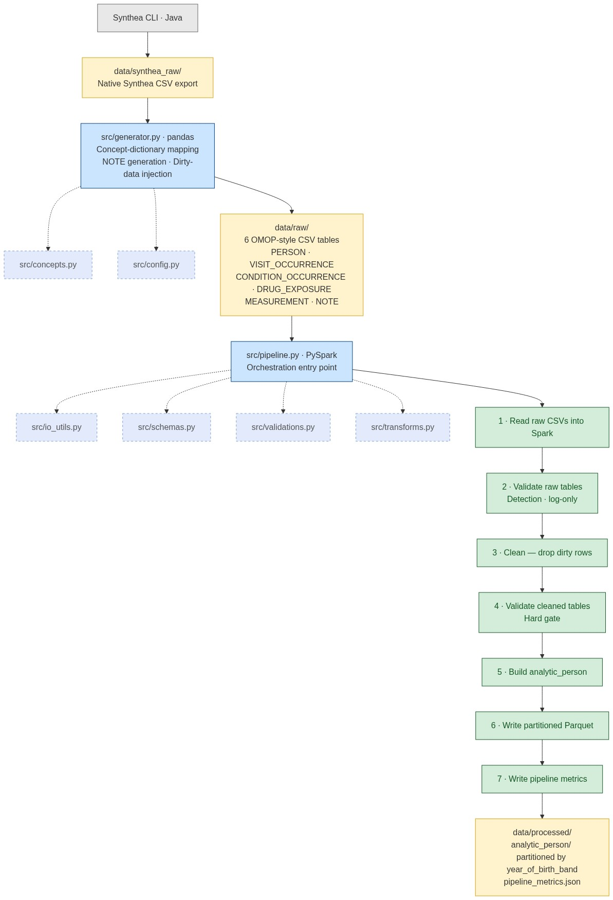

# Synthetic OMOP-Style Healthcare Batch Pipeline

A Python/PySpark batch pipeline project built on a fully synthetic OMOP-style healthcare dataset. The goal of Block 1 is to establish a clean, testable, and interview-ready foundation for a healthcare data pipeline using a simplified subset of OMOP-like tables. 

## Architecture



## Scope

Block 1 includes:
- project documentation (`spec.md`, `plan.md`, `tasks.md`)
- synthetic OMOP-style data design and generation via Synthea
- a PySpark batch pipeline with validation, cleaning, and transformation
- 103 tests with `pytest`
- a demo notebook

Block 1 does not include:
- large-scale performance tuning
- orchestration or scheduling
- cloud deployment
- full OMOP vocabulary mapping
- advanced healthcare semantics

## Tech stack

- Python 3.11+
- PySpark
- pandas (data generation)
- pytest
- Jupyter Notebook / JupyterLab
- Java 11+ (Synthea only)

## Project structure

```text
docs/           project specification, plan, and tasks
src/            pipeline modules and helper code
tests/          pytest-based tests (103 tests)
notebooks/      demo notebook (demo.ipynb)
scripts/        utility scripts (run_synthea.ps1)
data/synthea_raw/  raw Synthea CSV export (git-ignored)
data/raw/       simplified OMOP-style tables (git-ignored)
data/processed/ analytic_person partitioned Parquet (git-ignored)
data/sample/    tiny test fixtures (committed)
```

## Setup

Prerequisites:
- Python 3.11+
- Java 21 LTS (required once, to run Synthea and produce the raw patient export)

1. Create and activate a virtual environment.
2. Install dependencies from `requirements.txt`.
3. Download `synthea-with-dependencies.jar` from the [Synthea releases page](https://github.com/synthetichealth/synthea/releases/latest) and place it at `tools/synthea-with-dependencies.jar` (git-ignored).
4. Run Synthea to generate the raw CSV export into `data/synthea_raw/`.
5. Run the generator to map Synthea output into the simplified OMOP-style tables in `data/raw/`.
6. Run the pipeline to validate, clean, transform, and write `data/processed/`.
7. Run tests.
8. Open the notebook demo.

```powershell
# 1-2. Environment
python -m venv myenv
myenv\Scripts\activate             # Linux/macOS: source myenv/bin/activate
pip install -r requirements.txt

# 3-6. Run everything end-to-end (Synthea → generator → pipeline)
./scripts/run_all.ps1

# Or run each step individually:
# ./scripts/run_synthea.ps1          # one-time Synthea export (requires Java 21)
# python -m src.generator            # map Synthea CSV → data/raw/
# python -m src.pipeline             # validate → clean → transform → data/processed/

# 7. Tests
pytest

# 8. Demo notebook
jupyter notebook notebooks/demo.ipynb
```

## Expected row counts

Data is generated with a fixed seed (`RANDOM_SEED=42`), so row counts are deterministic. After running the pipeline, your `data/processed/pipeline_metrics.json` should match these counts exactly.

| Table | Raw | Cleaned | Dropped |
|---|---:|---:|---:|
| person | 11,770 | 11,424 | 346 |
| visit_occurrence | 23,541 | 22,175 | 1,366 |
| condition_occurrence | 5,037 | 4,817 | 220 |
| drug_exposure | 4,564 | 4,223 | 341 |
| measurement | 24,431 | 22,639 | 1,792 |
| note | 46,729 | 22,847 | 23,882 |
| **analytic_person** | — | **11,424** | — |

Raw validation detects 21 check failures across the 6 tables. After cleaning, all checks pass with 0 violations. The full reference file is at [`data/sample/expected_metrics.json`](data/sample/expected_metrics.json).

## Data note

This project uses synthetic OMOP-style healthcare data only. Bulk generated data is stored locally and is not committed to version control.

## Status

Block 1 is complete. All 12 implementation phases have been merged, 103 tests pass, and the demo notebook runs end-to-end. Later blocks may expand the schema, increase scale, and introduce more advanced engineering concerns.