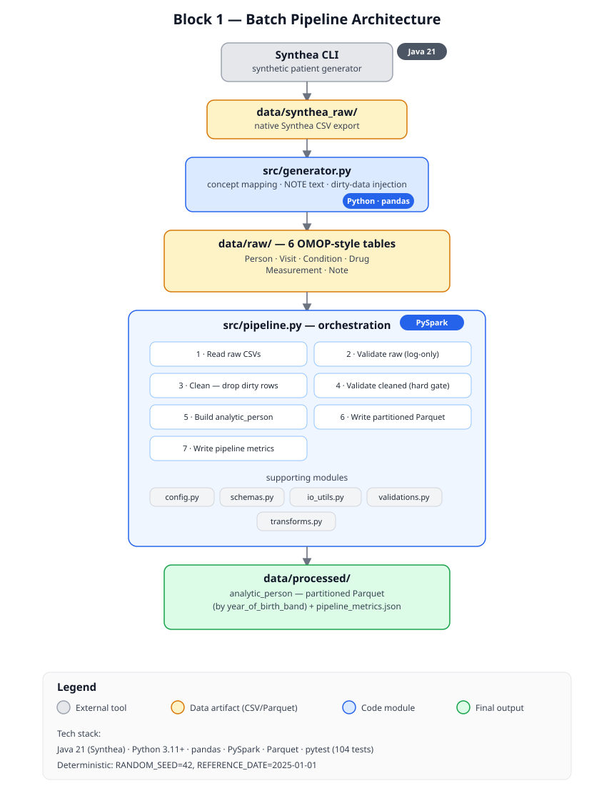
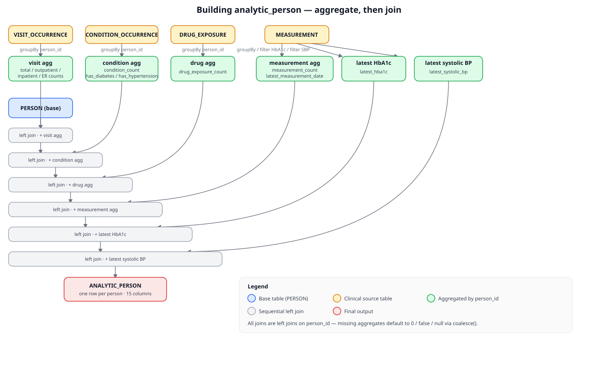

# Synthetic OMOP-Style Healthcare Batch Pipeline

A Python/PySpark batch pipeline project built on a fully synthetic OMOP-style healthcare dataset. The goal of Block 1 is to establish a clean, testable, and interview-ready foundation for a healthcare data pipeline using a simplified subset of OMOP-like tables. 

## Business value

This project demonstrates a production-ready healthcare data pipeline that takes raw synthetic patient data and transforms it into a clean, validated, analytics-ready dataset — the kind of foundation that healthcare organizations need before they can do anything useful with their data. It enforces data quality at every step: detecting nulls, duplicates, orphaned records, and out-of-range values, then cleaning them systematically with full before-and-after traceability. The output — a single patient-level table with visit counts, chronic condition flags, and latest lab values — is the building block for clinical analytics like population health management, risk stratification, and care gap identification. By using OMOP-style conventions, the pipeline speaks the same language as industry-standard research networks (OHDSI), making it portable across health systems. The deterministic, seed-based design means results are fully reproducible, which is critical for regulatory and audit requirements in healthcare. In short, it solves the unglamorous but essential problem that most health data projects fail on: getting messy clinical data into a trustworthy, queryable shape before any analytics or AI can begin.

## Architecture



## Output dataset

The pipeline produces a patient-level analytics table (`analytic_person`) with one row per person, containing:

- age (as of 2025-01-01) and decade band (e.g., `1980s`)
- visit counts — total, outpatient, inpatient, and ER
- condition count with diabetes and hypertension flags
- drug exposure count
- measurement count
- latest HbA1c value
- latest systolic blood pressure
- latest measurement date

Written as partitioned Parquet under `data/processed/`, partitioned by `year_of_birth_band`.

### Building analytic_person



Each clinical table is aggregated by `person_id`, then left-joined sequentially onto PERSON to produce one row per person.

## Scope

Block 1 includes:
- project documentation (`spec.md`, `plan.md`, `tasks.md`)
- synthetic OMOP-style data design and generation via Synthea
- a PySpark batch pipeline with validation, cleaning, and transformation
- 105 tests with `pytest`
- a demo notebook

Block 1 does not include:
- large-scale performance tuning
- orchestration or scheduling
- cloud deployment
- full OMOP vocabulary mapping
- advanced healthcare semantics

## Tech stack

- Python 3.11+
- PySpark
- pandas (data generation)
- pytest
- Jupyter Notebook / JupyterLab
- Java 21 LTS (Synthea only)

## Results

Pipeline processes roughly 10,000 synthetic patients across 6 tables end-to-end via one command. 105/105 tests passing. The data-quality gate catches and reports null, duplicate, orphan, and out-of-range violations before any row reaches `data/processed/`. Whitelist coverage was expanded from 3 conditions/6 drugs to 11 conditions/17 drugs, using codes verified against real Synthea `REASONCODE` linkages rather than assumed mappings — broadening the dataset for downstream RAG use in later blocks. Synthea's population, condition, visit, and note generation are fully deterministic given a fixed seed; `measurement` and `drug_exposure` carry a small (~0.1-0.2%) run-to-run variance traced to Synthea's own internal randomness, documented as a known limitation below.

## Project structure

```text
docs/           project specification, plan, and tasks
src/            pipeline modules and helper code
tests/          pytest-based tests (105 tests)
notebooks/      demo notebook (demo.ipynb)
scripts/        utility scripts (run_all.py)
data/synthea_raw/  raw Synthea CSV export (git-ignored)
data/raw/       simplified OMOP-style tables (git-ignored)
data/processed/ analytic_person partitioned Parquet (git-ignored)
data/sample/    tiny test fixtures (committed)
```

## Setup

Prerequisites:
- Python 3.11+
- Java 21 LTS (required once, to run Synthea and produce the raw patient export)

1. Create and activate a virtual environment.
2. Install dependencies from `requirements.txt`.
3. Download `synthea-with-dependencies.jar` from the [Synthea releases page](https://github.com/synthetichealth/synthea/releases/latest) and place it at `tools/synthea-with-dependencies.jar` (git-ignored).
4. Run Synthea to generate the raw CSV export into `data/synthea_raw/`.
5. Run the generator to map Synthea output into the simplified OMOP-style tables in `data/raw/`.
6. Run the pipeline to validate, clean, transform, and write `data/processed/`.
7. Run tests.
8. Open the notebook demo.

```bash
# 1-2. Environment
python -m venv myenv
source myenv/bin/activate           # Windows: myenv\Scripts\activate
pip install -r requirements.txt

# 3-6. Run everything end-to-end (Synthea → generator → pipeline)
python scripts/run_all.py

# Or run each step individually:
# python -m src.generator            # map Synthea CSV → data/raw/
# python -m src.pipeline             # validate → clean → transform → data/processed/

# 7. Tests
pytest

# 8. Demo notebook
jupyter notebook notebooks/demo.ipynb
```

### Environment variable overrides

These are optional — defaults work out of the box for this project's local dev setup. Override them if you're running on a different machine or want a different population/seed without editing `src/config.py`.

| Variable | Default | Purpose |
|---|---|---|
| `BLOCK1_JAVA21_HOME` | Local Java 21 install path | Point Spark at a Java 21 JDK (required — PySpark is incompatible with Java 25+) |
| `BLOCK1_HADOOP_HOME` | `~/hadoop` | Hadoop native libs location (Windows only) |
| `BLOCK1_RANDOM_SEED` | `42` | Override the generator's random seed |
| `BLOCK1_REFERENCE_DATE` | `2025-01-01` | Override the "as of" date used for age calculation |

`scripts/run_all.py --seed`/`--reference-date` set the latter two automatically to match what Synthea was run with.

## Expected row counts

Data is generated with a fixed seed (`RANDOM_SEED=42`), so row counts are deterministic. After running the pipeline, your `data/processed/pipeline_metrics.json` should match these counts exactly.

| Table | Raw | Cleaned | Dropped |
|---|---:|---:|---:|
| person | 11,784 | 11,436 | 348 |
| visit_occurrence | 23,568 | 22,188 | 1,380 |
| condition_occurrence | 14,264 | 13,639 | 625 |
| drug_exposure | 6,322 | 5,860 | 462 |
| measurement | 24,616 | 22,881 | 1,735 |
| note | 23,568 | 21,535 | 2,033 |
| **analytic_person** | — | **11,436** | — |

Note: `measurement` and `drug_exposure` row counts can vary slightly (~0.1-0.2%) across separate Synthea regenerations, even with both `-s` and `-cs` pinned — Synthea's medication and lab/vitals modules appear to have a source of randomness not controlled by either seed flag. `person`, `visit_occurrence`, `condition_occurrence`, and `note` are fully reproducible across repeated runs (verified across 3 full-population regenerations). This doesn't affect `generator.py`/`pipeline.py`'s own reproducibility given a fixed Synthea export.

Raw validation detects 20 check failures across the 6 tables. After cleaning, all checks pass with 0 violations. The full reference file is at [`data/sample/expected_metrics.json`](data/sample/expected_metrics.json).

### Drop reasons

Rows can fail multiple checks, so individual violation counts may exceed the total dropped.

| Table | Dropped | Reasons (violations detected) |
|---|---:|---|
| person | 348 | null `year_of_birth` (177), duplicate PK (174) |
| visit_occurrence | 1,380 | null `visit_concept_id` (353), bad end date (350), duplicate PK (348) |
| condition_occurrence | 625 | null `condition_concept_id` (213), bad end date (212), duplicate PK (210) |
| drug_exposure | 462 | null `drug_concept_id` (94), bad end date (102), negative `days_supply` (93), negative `quantity` (94), duplicate PK (93) |
| measurement | 1,735 | null `measurement_date` (370), negative `value_as_number` (371), orphan `person_id` (368), duplicate PK (363) |
| note | 2,033 | null `note_text` (351), orphan `visit_occurrence_id` (354), duplicate PK (348) |

## Tests

105 tests across 5 test files, all run with `pytest` against in-memory Spark DataFrames.

| File | Tests | What it covers |
|---|---:|---|
| `test_validations.py` | 50 | One test per validation check per table — null checks, duplicate PK, bad dates, negative values, orphan FKs, plus edge cases (e.g., null end date is allowed). Also tests `validate_all` aggregation. |
| `test_transforms.py` | 45 | Cleaning functions for all 6 tables — verifies each drop rule (nulls, bad dates, negatives, orphans, duplicates) and edge cases (e.g., zero `days_supply` is kept, null optional FKs are kept). Also tests `clean_all` before/after metrics and `build_analytic_person` — age calculation, decade band, visit count aggregation, condition flags, latest measurement values, and null handling for persons with no data. |
| `test_pipeline.py` | 7 | Pipeline orchestration — `PipelineValidationError` type, hard gate pass/fail behavior, error message content, and validation logging (warnings on violations, silence on clean data, stage name in log output). |
| `test_concepts.py` | 2 | Consistency between the concept whitelist dicts and their name-lookup dicts — every `CONDITION_CONCEPT_ID`/`DRUG_CONCEPT_ID` value has a matching entry in `CONDITION_NAMES`/`DRUG_NAMES`. |
| `test_io_utils.py` | 1 | Regression test for the CSV multiline bug — a note with an embedded `\n\n` reads back as one correct row, not corrupted phantom rows. |

### Test categories

| Category | Tests | Examples |
|---|---:|---|
| Null checks | 27 | Required fields reject nulls; optional fields (end dates, FKs) allow them |
| Duplicate PK | 13 | Each table's dedup logic, including the "no dup when unique" case |
| Date order | 9 | End date before start date is rejected; equal dates are kept |
| Negative values | 8 | Negative `days_supply`, `quantity`, `value_as_number` are dropped; zero is kept |
| Orphan FK | 7 | Orphan `person_id` and `visit_occurrence_id` are dropped; null FKs are kept |
| Aggregation | 10 | Visit counts by type, condition flags, latest HbA1c/BP, zero counts for persons with no data |
| Pipeline | 7 | Hard gate pass/fail, error message content, logging behavior |
| Integration | 3 | `validate_all` combines results, `clean_all` returns correct metrics |

Most tests use in-memory Spark DataFrames with minimal fixture data; test_io_utils.py is the one exception, writing a real temp CSV to test the file-reading path directly.

## Data note

This project uses synthetic OMOP-style healthcare data only. Bulk generated data is stored locally and is not committed to version control.

## AI-assisted workflow

Built with Claude Code as the implementation agent, directed through explicit, reviewed instructions rather than open-ended prompts. Every change went through an independent review pass before committing, which caught real issues — a `NaN`-vs-`None` bug that worked by accident, a stale comment from an earlier change, and an age-calculation edit that quietly traded accuracy for code uniformity. Design decisions were made deliberately, not by default: rejecting cancer conditions from the whitelist since their only linked drugs aren't exclusive to one cancer type, and choosing deterministic phrase-bank notes over LLM-generated ones after pricing out both the Claude API and local Ollama as not worth it at this stage. See Implementation phases below for a phase-by-phase breakdown of what Claude built versus what was corrected or overridden.

## Implementation phases

Block 1 was built across 13 phases (0–12), each delivered as a separate branch and PR.

| Phase | Deliverable | Claude helped | User overrode |
|---:|---|---|---|
| 0 | Project documentation — `spec.md`, `plan.md`, `tasks.md` | Drafted spec, plan, and tasks docs | Selected the final project scope including the six healthcare tables and validation framework. Wrote initial DOD, partitioned write requirements, and NOTE table design. Decided to focus on batch processing rather than streaming architecture |
| 1 | Environment and config foundation — `src/config.py` | Built config with paths, constants, and seed values | — |
| 2 | Synthea inspection — grounded design in real Synthea output | Explored Synthea CSV/FHIR output, documented findings | Drove the inspection and performed manual validation of healthcare concepts. Corrected spec — visit type comes from ENCOUNTERCLASS, not SNOMED CODE |
| 3 | Concept dictionaries — `src/concepts.py` | Built concept ID lookup dictionaries from real Synthea codes | Validated healthcare concepts against real Synthea output to ensure the project remained realistic |
| 4 | PySpark schemas — `src/schemas.py` | Defined StructType schemas for all tables | Determined the final data model. Requested extending RACE_CONCEPT_ID with additional entries Claude's implementation missed |
| 5 | Data generator — `src/generator.py` | Built full generator with Synthea CSV mapping and dirty-data injection | Chose which data quality rules to implement and how they should be organized. Claude incorrectly described NOTE generation as "template-based" and referenced FHIR bundles — user caught both errors later |
| 6 | I/O utilities — `src/io_utils.py` | Built Spark read/write helpers | Identified 3 Java 21+/25 compatibility issues on Windows that Claude did not anticipate. Rejected unnecessary distributed infrastructure suggestions |
| 7 | Validations — `src/validations.py` | Built all validation checks (null, range, FK, date-order, duplicate) | Defined the validation framework and decided how checks should be organized |
| 8 | Transforms — `src/transforms.py` | Built cleaning functions and `analytic_person` join/aggregation | Validated Spark logic and business requirements to ensure alignment with data engineering best practices |
| 9 | Pipeline orchestration — `src/pipeline.py` | Built pipeline with two-pass validation and hard gate | — |
| 10 | Tests — 103 pytest tests | Wrote all 103 tests | Determined the testing strategy — reserved an entire phase for tests rather than writing them incrementally. Defined what the tests should cover |
| 11 | Demo notebook — `notebooks/demo.ipynb` | Built end-to-end notebook walkthrough | Identified sys.path fix and 4 Java compatibility fixes Claude missed across sessions |
| 12 | Polish — docs cleanup, `run_all.py`, final fixes | Drafted docs and scripts | Caught inaccurate "template-based" NOTE wording. Rejected PowerShell-only `run_all.ps1` — required a single cross-platform Python script. Identified missing pipeline metrics despite being in the spec. Evaluated AI suggestion to use `local[*]` for tests — found it slower, reverted. Determined final documentation structure and implementation roadmap |

## Status

Block 1 is complete. All phases have been merged, 105 tests pass, and the demo notebook runs end-to-end. Later blocks may expand the schema, increase scale, and introduce more advanced engineering concerns.